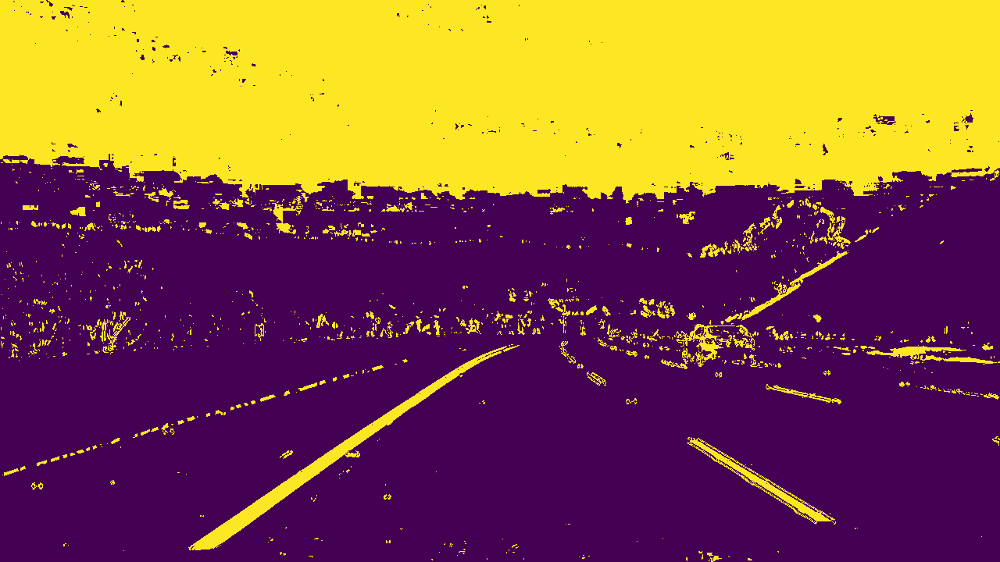

# **Advanced Lane Finding Project**

``` The goals / steps of this project are the following:

* Compute the camera calibration matrix and distortion coefficients given a set of chessboard images.
* Apply a distortion correction to raw images.
* Use color transforms, gradients, etc., to create a thresholded binary image.
* Apply a perspective transform to rectify binary image ("birds-eye view").
* Detect lane pixels and fit to find the lane boundary.
* Determine the curvature of the lane and vehicle position with respect to center.
* Warp the detected lane boundaries back onto the original image.
* Output visual display of the lane boundaries and numerical estimation of lane curvature and vehicle position. 
```

## ** Pipeline of the Project **
1. Calibrate the Camera
2. Input Original Images
3. Undistort the Images
4. Gradient as we all Color Threshold the Images
5. Perspective Tranforming the Image 
6. Find the lane lines by using - Sliding Window or Search Around poly approach
7. Calculate Radius of curvature as well as offset in meters
8. Visualizing the Images

Refer to PDF document for the Flow Chart of Advanced Lane Lines Detection pipeline.

---

## Camera Calibration

#### 1. Briefly state how you computed the camera matrix and distortion coefficients. Provide an example of a distortion corrected calibration image.

   1.1 The code for this step is contained in "Advanced Lane Line.ipynb" under "Calibrate Camera Function" markdown

` def calibrate_camera():
    objp = np.zeros((9 * 6, 3), np.float32)
    objp[:,:2] = np.mgrid[0:9, 0:6].T.reshape(-1, 2)

    # 1. Arrays to store object points and image points from all the images.
    objpoints = [] # 3d points in real world space
    imgpoints = [] # 2d points in image plane.
    
    # 2. Take all images from the camera_cal folder to undistort
    os.listdir("camera_cal/")
    for filename in os.listdir("camera_cal/"):
        #  2.1 Reading files for filename 
        img = mpimg.imread("camera_cal/" + filename)

    # Step through the list and search for chessboard corners
    #for i, fname in enumerate(images):    
    #img = cv2.imread(fname)
        
        #  2.2 gray scale image
        gray = cv2.cvtColor(img, cv2.COLOR_RGB2GRAY)

        #  2.3 Find the chessboard corners
        ret, corners = cv2.findChessboardCorners(gray, (9, 6), None)

        #  2.4 If found, add (append) object points, image points
        if ret == True:
            objpoints.append(objp)
            imgpoints.append(corners)
            #  2.4.1 Draw the corners
            corner = cv2.drawChessboardCorners(img, (9, 6), corners, ret) 
            mpimg.imsave("camera_corner/" + filename, corner)
        
        # 2.5 Camera calibration, given object points, image points, and the shape of the grayscale image
        ret, mtx, dist, rvecs, tvecs = cv2.calibrateCamera(objpoints, imgpoints, gray.shape[::-1], None, None)
        
        # 3. Plot the result, the images.   
        
    return ret, mtx, dist, rvecs, tvecs 
  `
   1.2 I start by preparing "object points", which will be the (x, y, z) coordinates of the chessboard corners in the world. Here I am assuming the chessboard is fixed on the (x, y) plane at z=0, such that the object points are the same for each calibration image.  Thus, `objp` is just a replicated array of coordinates, and `objpoints` will be appended with a copy of it every time I successfully detect all chessboard corners in a test image.  `imgpoints` will be appended with the (x, y) pixel position of each of the corners in the image plane with each successful chessboard detection.  

Example-

Original Image : 


Calibrated Undistorted Image : 


   1.3 I then used the output `objpoints` and `imgpoints` to compute the camera calibration and distortion coefficients using the `cv2.calibrateCamera()` function. The obatined `mtx` (camera matrix) and `dist` (distortion coeffiencent) were dumped on pickle for later use.  
   
   1.4 I applied this distortion correction to the test image using the `cv2.undistort()` function. 
   
Example-

Calibrated Undistorted Image : 


---

### Pipeline (single images)

#### 1. Provide an example of a distortion-corrected image.

   1.1 Ran the camera calibration function to determine the calibration matrix and distortion coefficients using the cv2.calibrateCamera() function to remove any radial and tangential distortion from the original car images:
   
Example-

Original Image : 


Calibrated Undistorted Image : 


#### 2. Describe how (and identify where in your code) you used color transforms, gradients or other methods to create a thresholded binary image.  Provide an example of a binary image result.

   2.1 Performed below mentioned Gradient Threshold on the images:
    1. Sobel in the X direction 2. Sobel in the Y direction 3. Magnitude Threshold  4. Direction Threshold

   2.2 Perfomed below mentioned HLS Color Space Threshold on the images:
    1. H channel  2. S channel  3. L channel
    
   2.3 Perfomed below mentioned HLS Color Space Threshold on the images:
   1. V channel
    
   2.4 Combined the threshold results of (1. Sobel in the X direction 3. Magnitude Threshold  4. Direction Threshold) gradient threshold with the S channel (HLS) and V cahnnel (HSV) color space threshold. The combination resulted in a binary thresholded images. 
   
Example-

Thresholded Image : 



#### 3. Describe how (and identify where in your code) you performed a perspective transform and provide an example of a transformed image.

   3.1 Initial Perspective tranformed was performed to determine the Source and Destination points. 

   3.2 The code for Perspective tranformation is located in "Advanced Lane Line.ipynb" under "Perspective Transform Function" markdown.  
`
def corners_unwarp(img):
    # 1. Pass in your image into this function 
    # 2. define offset for dst points
    #offset = 100 
    # 3. Convert to grayscale
    #gray = cv2.cvtColor(img, cv2.COLOR_BGR2GRAY)
    # 4. Grab image shape
    img_size = (img.shape[1], img.shape[0])
    
    # 5. define 4 source points src = np.float32([[,],[,],[,],[,]])
    #Note: you could pick any four of the detected corners 
    # as long as those four corners define a rectangle
    #One especially smart way to do this would be to use four well-chosen
    # corners that were automatically detected during the undistortion steps
    #We recommend using the automatic detection of corners in your code
    
    bottom_left = [270,720]
    bottom_right = [1127, 720]
    top_left = [620, 450]#565#550
    top_right = [720, 450]#750#735

    src = np.float32([bottom_left,bottom_right,top_right,top_left])

    bottom_left = [320,720]
    bottom_right = [920, 720]
    top_left = [320, 0]
    top_right = [920, 0]

    dst = np.float32([bottom_left,bottom_right,top_right,top_left])
    
    
    # 7. use cv2.getPerspectiveTransform() to get M, the transform matrix
    M = cv2.getPerspectiveTransform(src, dst)
    #Compute the inverse perspective transform:
    Minv = cv2.getPerspectiveTransform(dst, src)
            
    # 8. use cv2.warpPerspective() to warp your image to a top-down view
    warped = cv2.warpPerspective(img, M, img_size, flags=cv2.INTER_LINEAR)
    
    return warped, M, Minv, src, dst
   `
   3.4 The resulted perspective transform matrix ` M` and inverse perspective transform matrix ` Minv` were dumped on pickle for later use.
   
   3.3 Performed Perspective tranform on all the thresholded images.The resulted images provided the bird eye view of thresholded images.
   
Example-

Thresholded Image : 


#### 4. Describe how (and identify where in your code) you identified lane-line pixels and fit their positions with a polynomial?
   
   4.1 I used a sliding window approach to determine the lane lines on the binary thresholded image. The code for determining Lane Lines is located in "Advanced Lane Line.ipynb" under "Finding Lane - Implement Sliding Windows and Fit a Polynomial Function" markdown.
   
   4.2 It is very important to run and check you code on various images, so that no outliers (pixels) are identified in lane lines. I selected margin as 50, so that the pipeline works good for the video tested.

    ` def find_lane_pixels(binary_warped):
    # Take a histogram of the bottom half of the image
    histogram = np.sum(binary_warped[binary_warped.shape[0]//2:,:], axis=0)
    # Create an output image to draw on and visualize the result
    out_img = np.uint8(np.dstack((binary_warped, binary_warped, binary_warped))*255)
    
    # Find the peak of the left and right halves of the histogram
    # These will be the starting point for the left and right lines
    midpoint = np.int(histogram.shape[0]//2)
    leftx_base = np.argmax(histogram[:midpoint])
    rightx_base = np.argmax(histogram[midpoint:]) + midpoint

    # HYPERPARAMETERS
    # Choose the number of sliding windows
    nwindows = 9
    # Set the width of the windows +/- margin
    margin = 50 #100
    # Set minimum number of pixels found to recenter window
    minpix = 50

    # Set height of windows - based on nwindows above and image shape
    window_height = np.int(binary_warped.shape[0]//nwindows)
    # Identify the x and y positions of all nonzero pixels in the image
    nonzero = binary_warped.nonzero()
    nonzeroy = np.array(nonzero[0])
    nonzerox = np.array(nonzero[1])
    # Current positions to be updated later for each window in nwindows
    leftx_current = leftx_base
    rightx_current = rightx_base

    # Create empty lists to receive left and right lane pixel indices
    left_lane_inds = []
    right_lane_inds = []

    # Step through the windows one by one
    for window in range(nwindows):
        # Identify window boundaries in x and y (and right and left)
        win_y_low = binary_warped.shape[0] - (window+1)*window_height
        win_y_high = binary_warped.shape[0] - window*window_height
        win_xleft_low = leftx_current - margin
        win_xleft_high = leftx_current + margin
        win_xright_low = rightx_current - margin
        win_xright_high = rightx_current + margin
        
        # Draw the windows on the visualization image
        cv2.rectangle(out_img,(win_xleft_low,win_y_low),
        (win_xleft_high,win_y_high),(0,255,0), 2) 
        cv2.rectangle(out_img,(win_xright_low,win_y_low),
        (win_xright_high,win_y_high),(0,255,0), 2) 
        
        # Identify the nonzero pixels in x and y within the window #
        good_left_inds = ((nonzeroy >= win_y_low) & (nonzeroy < win_y_high) & 
        (nonzerox >= win_xleft_low) &  (nonzerox < win_xleft_high)).nonzero()[0]
        good_right_inds = ((nonzeroy >= win_y_low) & (nonzeroy < win_y_high) & 
        (nonzerox >= win_xright_low) &  (nonzerox < win_xright_high)).nonzero()[0]
        
        # Append these indices to the lists
        left_lane_inds.append(good_left_inds)
        right_lane_inds.append(good_right_inds)
        
        # If you found > minpix pixels, recenter next window on their mean position
        if len(good_left_inds) > minpix:
            leftx_current = np.int(np.mean(nonzerox[good_left_inds]))
        if len(good_right_inds) > minpix:        
            rightx_current = np.int(np.mean(nonzerox[good_right_inds]))

    # Concatenate the arrays of indices (previously was a list of lists of pixels)
    try:
        left_lane_inds = np.concatenate(left_lane_inds)
        right_lane_inds = np.concatenate(right_lane_inds)
    except ValueError:
        # Avoids an error if the above is not implemented fully
        pass

    # Extract left and right line pixel positions
    leftx = nonzerox[left_lane_inds]
    lefty = nonzeroy[left_lane_inds] 
    rightx = nonzerox[right_lane_inds]
    righty = nonzeroy[right_lane_inds]
    
    return leftx, lefty, rightx, righty, out_img


    def fit_polynomial(binary_warped):
    # Find our lane pixels first
    leftx, lefty, rightx, righty, out_img = find_lane_pixels(binary_warped)

    # Fit a second order polynomial to each using `np.polyfit`
    left_fit = np.polyfit(lefty, leftx, 2)
    right_fit = np.polyfit(righty, rightx, 2)

    # Generate x and y values for plotting
    ploty = np.linspace(0, binary_warped.shape[0]-1, binary_warped.shape[0] )
    try:
        left_fitx = left_fit[0]*ploty**2 + left_fit[1]*ploty + left_fit[2]
        right_fitx = right_fit[0]*ploty**2 + right_fit[1]*ploty + right_fit[2]
    except TypeError:
        # Avoids an error if `left` and `right_fit` are still none or incorrect
        print('The function failed to fit a line!')
        left_fitx = 1*ploty**2 + 1*ploty
        right_fitx = 1*ploty**2 + 1*ploty

    ## Visualization ##
    # Colors in the left and right lane regions
    out_img[lefty, leftx] = [255, 0, 0]
    out_img[righty, rightx] = [0, 0, 255]

    # Plots the left and right polynomials on the lane lines
    plt.plot(left_fitx, ploty, color='yellow')
    plt.plot(right_fitx, ploty, color='yellow')

    return out_img, ploty, left_fit, right_fit, left_fitx, right_fitx
        `
   4.2 The resulted images provided the Sliding window view of Binary thresholded images.
   
Example-

Bird Eye View Image : 


#### 5. Describe how (and identify where in your code) you calculated the radius of curvature of the lane and the position of the vehicle with respect to center.

   5.1 The radius (in meters) as well as the offset from center (in meters) was calculated on all the sliding view images. 
   
   5.2 The code to determine the right and left lane curvature radius is located in "Advanced Lane Line.ipynb" under "Measuring curvature of the lanes and Vehicle position wrt center Function" markdown.

   ` def measure_curvature_realm(binary_warped,ym_per_pix,xm_per_pix):
    
    ym_per_pix = 30/720 # meters per pixel in y dimension
    xm_per_pix = 3.7/700 # meters per pixel in x dimension
    
    # Find our lane pixels first
    leftx, lefty, rightx, righty, out_img = find_lane_pixels(binary_warped)

    # Fit a second order polynomial to each using `np.polyfit`
    left_fit_cr = np.polyfit(lefty*ym_per_pix, leftx*xm_per_pix, 2)
    right_fit_cr = np.polyfit(righty*ym_per_pix, rightx*xm_per_pix, 2)

    # Generate x and y values for plotting
    plot_y = np.linspace(0, binary_warped.shape[0]-1, binary_warped.shape[0] )
    
    '''
    Calculates the curvature of polynomial functions in meters.
    '''

    # Define y-value where we want radius of curvature
    # We'll choose the maximum y-value, corresponding to the bottom of the image
    y_eval = np.max(plot_y)
    
    # Calculation of R_curve (radius of curvature)
    left_curverad = ((1 + (2*left_fit_cr[0]*y_eval*ym_per_pix + left_fit_cr[1])**2)**1.5) / np.absolute(2*left_fit_cr[0])
    right_curverad = ((1 + (2*right_fit_cr[0]*y_eval*ym_per_pix + right_fit_cr[1])**2)**1.5) / np.absolute(2*right_fit_cr[0])
    
     # offset from center
     # determining the x intercept left and right lane when y value is maximum
    x_left_eval = left_fit[0]*y_eval**2 + left_fit[1]*y_eval + left_fit[2]
    x_right_eval = right_fit[0]*y_eval**2 + right_fit[1]*y_eval + right_fit[2]
    #determing location of car per our calculation
    car_location_m = x_left_eval+(x_right_eval - x_left_eval) / 2
    
    # 2.23.2 Calculate distance from center
    center_car = binary_warped.shape[1]/2
    off_center = (center_car - car_location_m) * xm_per_pix

    return left_curverad, right_curverad, off_center
 `

   5.3 The code determined left and right curvature radius values, which I then used to compute the offset from center.
   
   5.4 The determined values were then plotted on the image.
   
Example-

Resulting Image : 


#### 6. Provide an example image of your result plotted back down onto the road such that the lane area is identified clearly.

   6.1 Finally, the lane area were identified and the results were plotted on the image. 
   
   6.2 Below code lines were used to implement this step:
    
    ` ## Visualization ##
    # Create an image to draw on and an image to show the selection window
    visual_img1 = np.uint8(np.dstack((top_down1, top_down1, top_down1))*255)
    visual_img2 = np.zeros_like(visual_img1)
    # Generate a polygon to illustrate the search window area
    # And recast the x and y points into usable format for cv2.fillPoly()
    left_line_window = np.array([np.transpose(np.vstack([left_fitx, ploty]))])
    right_line_window = np.array([np.flipud(np.transpose(np.vstack([right_fitx, ploty])))])
       line_pts = np.hstack((left_line_window, right_line_window))
    # Draw the lane onto the warped blank image
    cv2.fillPoly(visual_img2, np.int_([line_pts]), (0,255, 0))
    visual_img3 = cv2.addWeighted(visual_img1, 1, visual_img2, 0.3, 0)

    # UnWarp the blank back to original image space using inverse perspective matrix (Minv)
    Unwarp_img = cv2.warpPerspective(visual_img2, Minv, (undistort_img.shape[1], undistort_img.shape[0])) 
    # Combine the result with the original image
    Final_Image = cv2.addWeighted(radius_m, 1, Unwarp_img, 0.3, 0)

    plt.imshow(Final_Image)
    plt.title('Final View')
    plt.figure(figsize=(24,9))
    
    `
Example-

Final Image : 


   6.3 Once the final output was generated, the bird eye view as well as the sliding window image was overlayed on the Final image.
   6.4 below code was used to execute this:
   
      ` result = np.copy(Final_Image)
        topdown = np.dstack((top_down1,top_down1,top_down1))*255
        xpos = 50
        ypos = 50

        topdown_resize = cv2.resize(topdown, None, fx = 0.25, fy = 0.25, interpolation = cv2.INTER_CUBIC)
        result[ypos:ypos+topdown_resize.shape[0],xpos:xpos+topdown_resize.shape[1]] = topdown_resize

        xpos1 = 50
        ypos1 = 250

        out_img_resize = cv2.resize(out_img, None, fx = 0.25, fy = 0.25, interpolation = cv2.INTER_CUBIC)
        result[ypos1:ypos1+out_img_resize.shape[0],xpos1:xpos1+out_img_resize.shape[1]] = out_img_resize

        plt.imshow(result)
        `
   
   
   
---

### Pipeline (video)

#### 1. Provide a link to your final video output.  Your pipeline should perform reasonably well on the entire project video (wobbly lines are ok but no catastrophic failures that would cause the car to drive off the road!).

Pipeline for the video is located in "Advanced Lane Line.ipynb" file. It used all the above described functions.
I have implemented 2 ways for video pipeline.The basic difference is ways for determining lane lines: - 

###### Method 1 uses Sliding Window and Serach around Poly approach both for determining lane lines.
1. For first frame use - Sliding Window method
2. If the result of a frame - from search around poly gave `left_fit` and `right_fit` as null values. Then the frame uses the Sliding window approach for determining results.
3. Remaining frames uses search around poly approach to find lane lines. The method uses a way for averaging the results of no. of frames ( tried with various values) to determine mean `left_fit` and mean `right_fit`.

Here's a link to my video result : [Project_video_output] (https://github.com/amundada2310/CarND-Advanced-Lane-Lines-Final/blob/master/project_video_output1.mp4)

###### Method 2 uses just the Sliding Window method to determine lane lines.
1. The method uses a way for averaging the results of (10) frames to determine mean `left_fit` and mean `right_fit`.


Here's a link to my video result : [Project_video_output] (https://github.com/amundada2310/CarND-Advanced-Lane-Lines-Final/blob/master/project_video_output1.mp4)


---

### Discussion

#### 1. Briefly discuss any problems / issues you faced in your implementation of this project.  Where will your pipeline likely fail?  What could you do to make it more robust?

I was able to execute the code for on project_video_output.mp, and performed good under various scenarios.

Output Video Observations and possible solutions:

1. I tried with selecting various margins value for detecing lane lines. When margin selected was between range 50 - 65 it was not detecting outliers.
2. I tried with various thresholding values. The executed code was facing difficulties while entering from shadowed area to brighter area. I tried to fine this more by adding a HSV - V channel threshold. This can be fine tuned more by selecting different thresholding combination as well as values, especially using techniques to detect various range of yellow color along with white color. Probably, using RGB white, RGB yellow, HSL yellow.
3. Both the approach worked fine and provided acceptable results.
4. The executed code worked fine for the bumpy regions on the road.


To make pipeline Robust-

1. Adding an approach to help the pipeline perform well in sharp turning conditions.
2. As mentioned earlier, selecting different thresholding combinations along with fine tuning of values.

Addition-
New technique SCNN could help giving more robust output. Spatial CNN (SCNN) proposes an architecture which “generalizes traditional deep layer-by-layer convolutions to slice-by slice convolutions within feature maps”.


